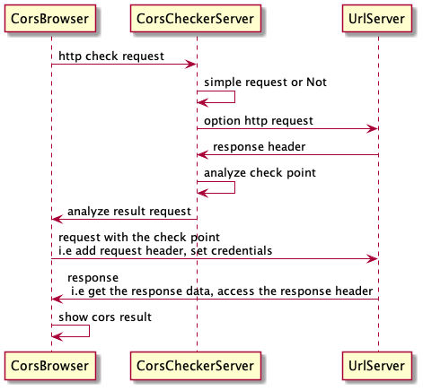

# Table of Contents

1.  [About](#org7795f38)
2.  [Usage](#org78321a3)
3.  [The timing chart](#org3db7985)
4.  [Check point](#orgd20e53a)
5.  [todo list](#org682f10e)

# About

-   It is a tool which used to detect a http request is a [CORS](https://developer.mozilla.org/en-US/docs/Web/HTTP/CORS) request or not.

# Usage

-   run the checker-server
    
        sh run.sh
-   test your request
    [restclient http](./cors.http)

# The timing chart

# Check point

<table border="2" cellspacing="0" cellpadding="6" rules="groups" frame="hsides">

<colgroup>
<col  class="org-left" />

<col  class="org-left" />

<col  class="org-left" />

<col  class="org-left" />

<col  class="org-left" />

<col  class="org-left" />
</colgroup>
<tbody>
<tr>
<td class="org-left">direction</td>
<td class="org-left">The check point</td>
<td class="org-left">cors request</td>
<td class="org-left">unsafe request</td>
<td class="org-left">control by preflighted request</td>
<td class="org-left">affect</td>
</tr>

<tr>
<td class="org-left">response</td>
<td class="org-left">Access-Control-Allow-Credentials</td>
<td class="org-left">different with withCredentials</td>
<td class="org-left">true</td>
<td class="org-left">no</td>
<td class="org-left">browser will block access to the response</td>
</tr>

<tr>
<td class="org-left">response</td>
<td class="org-left">Access-Control-Allow-Origin</td>
<td class="org-left">different with request origin</td>
<td class="org-left">wildcard</td>
<td class="org-left">yes</td>
<td class="org-left">browser will block data request</td>
</tr>

<tr>
<td class="org-left">response</td>
<td class="org-left">Access-Control-Allow-Methods</td>
<td class="org-left">origin confilct and out of GET、HEAD、POST</td>
<td class="org-left">-</td>
<td class="org-left">yes</td>
<td class="org-left">browser will block data request</td>
</tr>

<tr>
<td class="org-left">response</td>
<td class="org-left">Access-Control-Allow-Headers</td>
<td class="org-left">wildcard</td>
<td class="org-left">wildcard</td>
<td class="org-left">yes</td>
<td class="org-left">browser will block access to the response</td>
</tr>

<tr>
<td class="org-left">response</td>
<td class="org-left">Access-Control-Expose-Headers</td>
<td class="org-left">out of response headers</td>
<td class="org-left">wildcard</td>
<td class="org-left">yes</td>
<td class="org-left">JavaScript can not access response headers</td>
</tr>

<tr>
<td class="org-left">response</td>
<td class="org-left">Set-Cookie</td>
<td class="org-left">Access-Control-Allow-Origin is wildcard</td>
<td class="org-left">-</td>
<td class="org-left">yes</td>
<td class="org-left">would not set a cookie</td>
</tr>
</tbody>
</table>

# todo list

-   check a request is a simple request or not
-   httpClient implement

